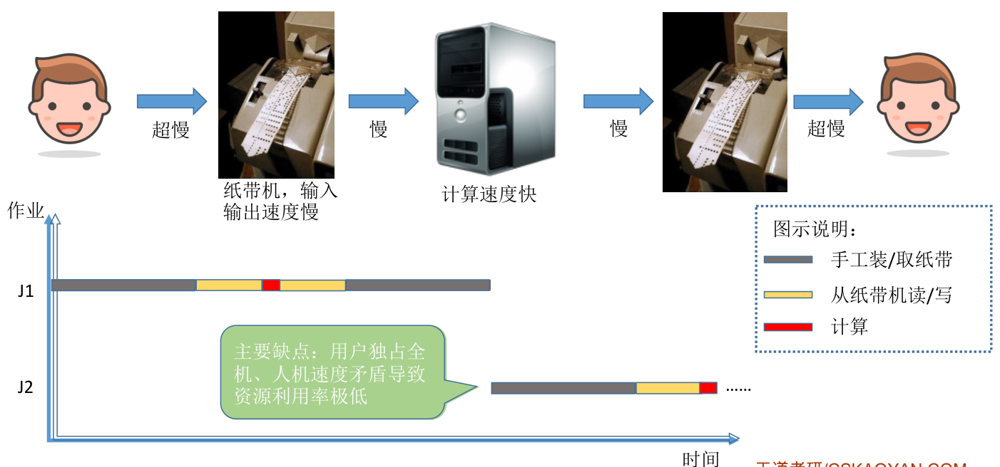
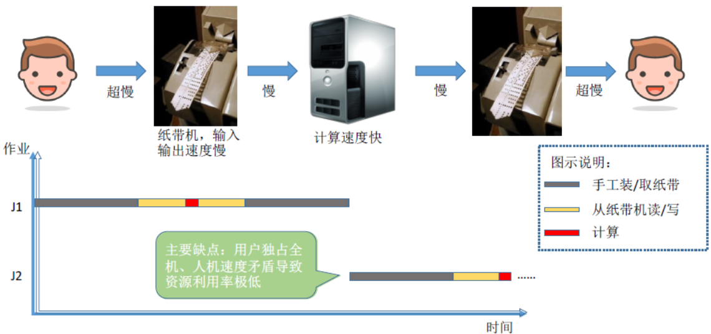
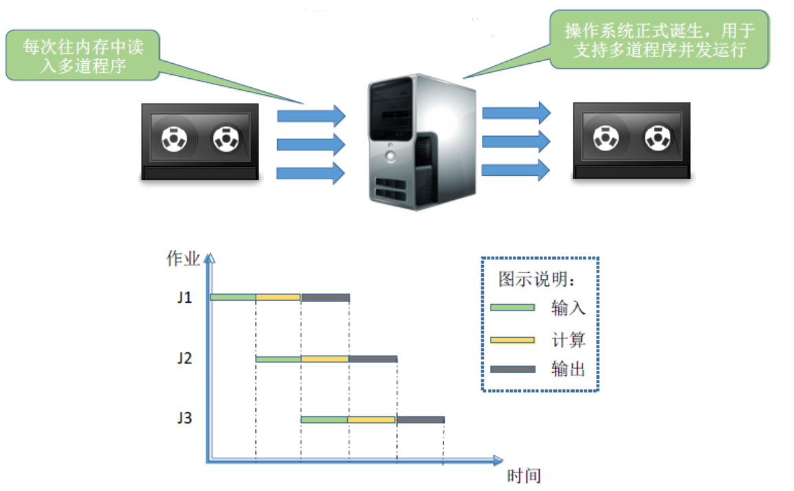
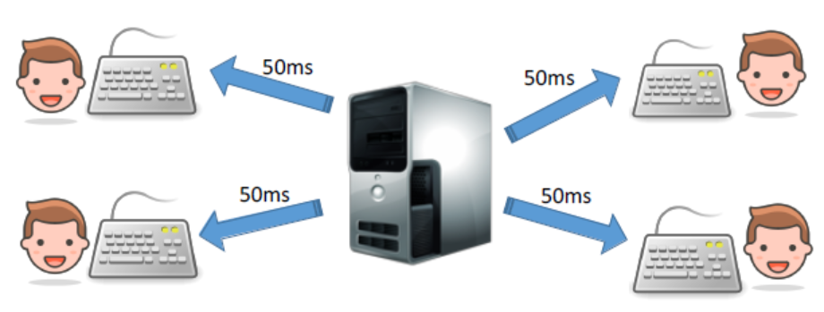
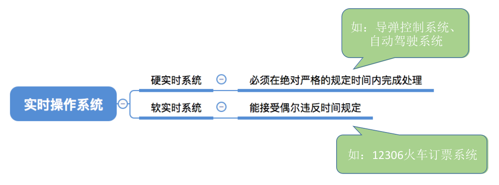

# 1.手工操作阶段

---

# 2.单道批处理系统

引入 **脱机输入/输出** 技术（用外围机 + 磁带完成），并由 **监督程序** 负责控制作业的输入、输出。

- **优点：** 缓解了一定程度的人机速度矛盾，资源利用率有所提升。
- **缺点：** 内存中仅能有一道程序运行，只有该程序运行结束之后才能调入下一道程序。CPU 有大量的时间是在空闲等待 I/O 完成。资源利用率依然很低。

---

# 3.多道批处理系统

- **优点：** 多道程序 **并发** 执行， **共享** 计算机资源；资源利用率大幅提升，CPU 和其他资源更能保持 “忙碌” 状态，系统吞吐率增大。
- **缺点：** 用户响应时间长，没有人机交互功能（用户提交自己的作业之后就只能等待计算机处理完成，中间不能控制自己的作业执行。比如：无法调试程序或者无法在程序运行过程中输入一些参数）。

---

# 4.分时操作系统

计算机以 **时间片** 为单位 **轮流** 为各个用户/作业服务，各个用户可通过终端与计算机进行交互。

- **优点：** 用户请求可以被及时响应，解决了人机交互问题；允许多个用户同时使用一台计算机，并且用户计算机的操作相互独立，感受不到别人的存在。
- **缺点：** 不能优先处理一些紧急任务。操作系统对各个用户/作业都是完全公平的，循环地为每个用户/作业服务一个时间片，不区分任务紧急性。

---

# 5.实时操作系统

在实时操作系统的控制下，计算机系统接收到外部信号后及时进行处理，并且要在严格的时限内处理完事件。实时操作系统的主要特点是 **及时性** 和 **可靠性** 。

- **优点：** 能够优先响应一些紧急任务，某些紧急任务不需时间片排队。

---

# 6.其它操作系统

| **操作系统类型**          | **特点**                       | **代表系统**              |
| ------------------------- | ------------------------------ | ------------------------- |
| **网络操作系统（NOS）**   | 主要用于网络管理和远程访问     | Windows Server、Cisco IOS |
| **分布式操作系统（DOS）** | 多台计算机协同工作，像一个整体 | Amoeba、Google Fuchsia    |
| **嵌入式操作系统**        | 用于智能设备，体积小、功耗低   | FreeRTOS、Zephyr、Android |