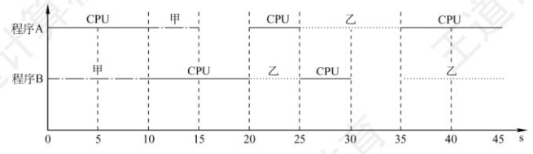

# 1.甘特图：

画图时要注意，如处理器、打印设备等资源是 **不能让两个程序同时使用** 的，有一个程序正在使用时，其他程序的请求只能排队。

步骤：
- 横坐标上标出合适的时间间隔，纵坐标上的点是程序的名字。
- 过横坐标上每个标出的时间点，向上作垂直于横坐标的虚线。
- 用几种不同的线（推荐用“直线”“波浪线”“虚线”三种，较易区分）代表对不同资源的占用，按照题目给出的任务时间片，平行于横坐标把不同程序对应的线段分别画出来。

---

# 3.操作系统的运行环境

---

1. 操作系统执行程序时，必须从起始地址开始执行。

---

1. 系统调用需要触发 **陷入指令** 。

---

6. 用户程序在用户态下使用特权指令会引起 **访管中断（陷入终端）** ，即用户程序需要通过一条 **访管指令（陷入指令）** 切换到核心态，以请求操作系统内核为其服务。用户态 ——> 核心态是由 **硬件** 完成的。

---

7. 外部中断是由 CPU 外部的事件引起的，如 I/O 设备的请求、时钟信号等。内部中断（也称异常）是由 CPU 内部的事件引起的，如访管指令、缺页异常等。

---

8. 外部中断处理过程，PC 值由中断隐指令（也就是由 **硬件**）自动保存，而通用寄存器内容由操作系统保存。

---

# 4.操作系统结构

---

1. 分层式架构的特点：各层之间只能是单向依赖或单向调用（因此不能跨层次访问！）；容易实现在系统中增加或替换一层而不影响其它层；系统效率较低。

2. 模块化架构的特点：各功能模块都在内核中，且模块之间相互调用、相互依赖；须通过消息传递进行通信，效率高；但是任何一个模块出错，都可能导致整个内核崩溃。

3. 微内核架构：内核足够小；基于客户/服务器模式；应用“机制与策略分离”的原理；采用面向对象技术。

4. 宏内核架构：

---

5. 在拥有 **外核** 的操作系统中，外核只负责 **硬件资源的分配、回收、保护等** ，进程管理相关的工作仍然由内核负责。

---

# 5.操作系统引导

---

1. 操作系统进行初始化的过程中，创建的是 **中断向量表** 。

