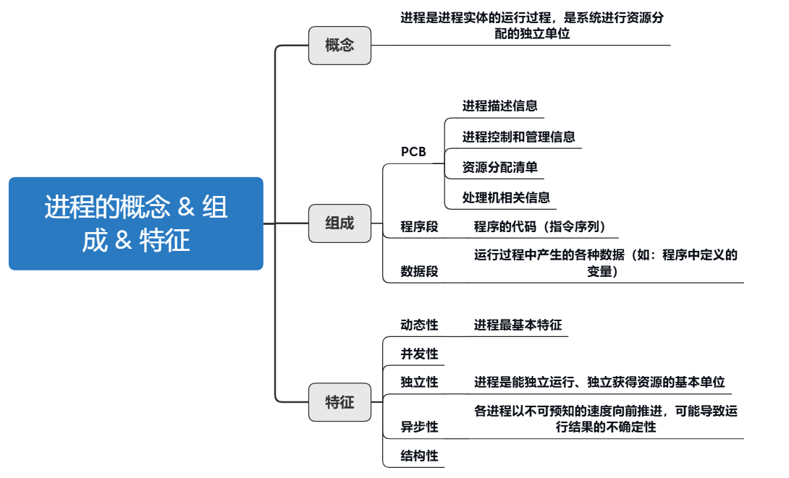
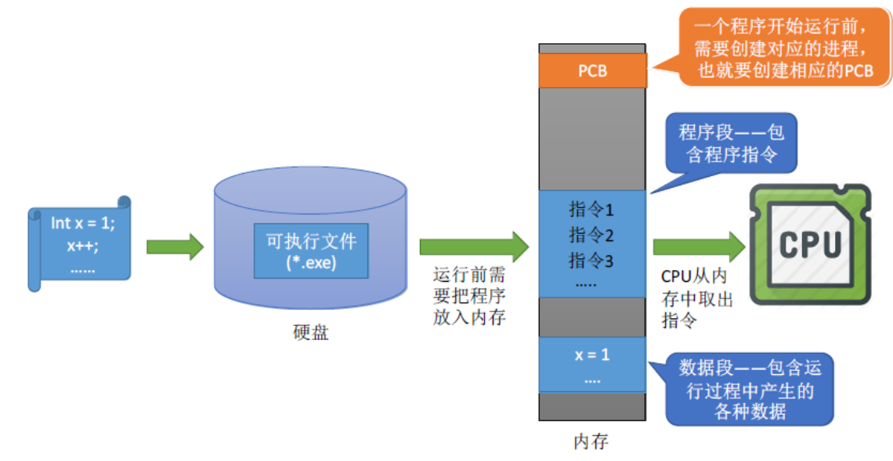
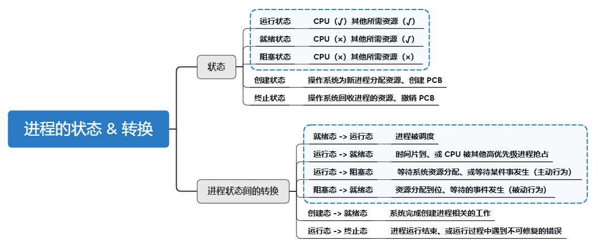
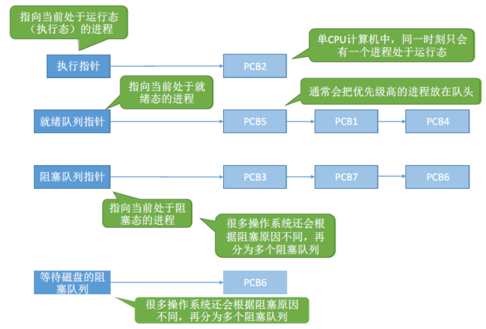
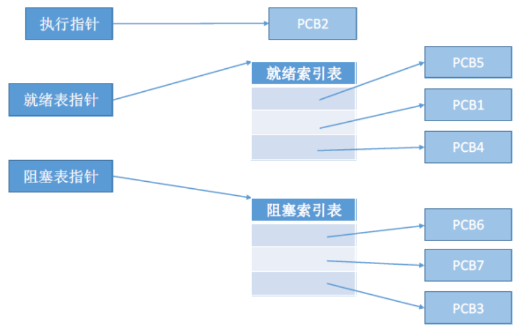

---

# 1.进程的概念

- **程序：** 静态的，是存放在 **磁盘里的可执行文件** ，是一系列的指令集合。
- **进程（Process）：** 动态的，是 **程序的一次执行过程** 。同一个程序可能有多个进程。

进程的基本描述信息全部存放在一个数据结构 **PCB（Process Control Block）** 中，即进程控制块。操作系统需要对各个并发运行的进程进行管理，但凡管理时所需要的信息，都会被放在 PCB 中。

---

# 2.进程的组成

---

## 2.1 PCB

操作系统对进程管理工作所需的信息都存放在 **PCB** 中。**PCB 是进程存在的唯一标志** ，当进程被创建时，操作系统为其创建 PCB，当进程结束时，会回收其 PCB 。

**PCB 包含的信息：**
1. **进程标识信息** ：用于唯一标识一个进程及其所属关系。
- 进程标识符（PID）
- 父进程标识符（PPID）
- 用户标识符（UID）/组标识符（GID）

2. **处理机（CPU）状态信息** ：保存进程在 CPU 中的执行上下文信息，用于进程切换时恢复运行状态。
- 程序计数器（PC）：记录 **下一条** 将要执行的指令地址  
- 程序状态字（PSW）：包含条件码、中断码等  
- 通用寄存器、堆栈指针等其他 CPU 寄存器值

3. **进程控制和调度信息** ：支持操作系统对进程进行调度和管理。
- 进程状态：就绪、运行、阻塞、终止等  
- 优先级信息  
- 所属调度队列信息  
- 进程间通信信息（如信号、管道、消息队列）  
- 资源使用统计信息（如 CPU 时间、I/O 次数）

4. **资源分配信息** ：记录进程已获得的系统资源。
- 打开的文件（文件描述符表）  
- 占用的内存区域（代码段、堆、栈等）  
- 使用的 I/O 设备（如设备句柄、缓冲区信息）

---

**注：** PCB 通常存储在 **内核空间** ，由操作系统维护，用户进程无法直接访问。操作系统的“进程切换”核心工作就是保存当前进程的 PCB → 读取下一个进程的 PCB → 恢复执行上下文。

---

## 2.2 代码段、数据段

- **代码段：** 程序的代码（指令序列），又称程序段。
- **数据段：** 存放程序运行过程中所使用的全局变量和静态变量等数据。

总之，PCB 是给操作系统用的；代码段、数据段是给进程自己用的。

这里简单了解下即可，后面的“内存管理——分段存储管理”中会详细说明。

---

## 2.3 程序运行过程

**进程** 和 **进程实体** 的区别：
- 进程（Process）是程序的一次执行，是 **动态** 的活动单位；
- 进程实体（Process Entity 或 Process Image）是构成进程的 **静态集合** ，包括程序代码、数据、PCB 等，是 **进程在某一时刻的完整状态描述** 。

> 在无线程模型中，进程是 **资源分配** 和调度的基本单位。
> 在引入线程模型之后：
>> 进程是资源分配的单位（内存空间、打开文件等）；
>> 线程是调度的单位（每个线程有独立的 PC、寄存器等执行上下文）。

---

# 3.进程的特征

- **动态性：** 进程是程序一次执行过程，是动态产生、变化和消亡的。
- **并发性：** 内存中有多个进程实体，各个进程可并发执行。
- **独立性：** 进程是能独立运行、独立获取资源的基本单位。
- **异步性：** 各个进程按各自独立的、不可预知的速度向前推进，操作系统需引入进程 **同步** 与 **互斥** 机制来协调进程之间的运行关系（后面会学到）。
- **结构性：** 每个进程都会配置一个 PCB。结构上看，进程由代码段、数据段、PCB 组成。

---

# 4.进程的状态 & 转换

---

## 4.1 进程的状态

| 状态名称                        | 描述                                                                                    |
| ------------------------------- | --------------------------------------------------------------------------------------- |
| **创建态（New）**               | 正在被创建。操作系统正在为其 **分配资源** 、初始化 PCB 等准备工作。                     |
| **就绪态（Ready）**             | 已准备好运行， **等待被调度到 CPU** 。具备运行条件，但 CPU 正忙。                       |
| **运行态（Running）**           | 占用 CPU 正在执行，系统中 **同时最多只有一个进程处于运行态（在单核系统下）** 。         |
| **阻塞态（Blocked / Waiting）** | 正在等待某事件（如 I/O 完成、资源释放），暂时无法继续执行，**即使有 CPU 也不能运行** 。 |
| **终止态（Terminated / Exit）** | 进程执行完成或被操作系统强制终止， **资源回收中或已回收完毕** ，将被从系统中移除。      |

进程 PCB 中，会有一个变量 `state` （可能是枚举、整型变量）来表示进程当前状态。

---

为了对同一个状态下的各个进程进行统一的管理，操作系统会将各个进程的 PCB 组织起来，组织方法如下：

1. **链接方式：** 最常见、效率高的实现方式。
   - 按照进程状态将 PCB 分为多个队列（比如就绪队列、阻塞队列、终止队列……）；
   - 每个 PCB 中包含一个指向下一个 PCB 的指针；
   - 操作系统保留指向每个队列头节点的指针。

---

2. **索引方式：** 查找/访问较快，嵌入式或特殊场景中较常见。
   - 操作系统维护多个数组或哈希表（例如按状态分类），也就是索引表；
   - 每个表项记录对应状态下的 PCB 或 PCB 地址；
   - 操作系统持保留指向各个索引表的指针。

---

## 4.2 进程状态的转换

- **阻塞态 -> 就绪态** 不是进程自身能控制的，是一种 **被动** 行为；
- **运行态 -> 阻塞态** 是一种进程自身做出的 **主动** 行为。

不能由阻塞态直接转换为运行态，也不能由就绪态直接转换为阻塞态（因为进入阻塞态是进程主动请求的，必然需要进程在运行时才能发出这种请求）。

---

