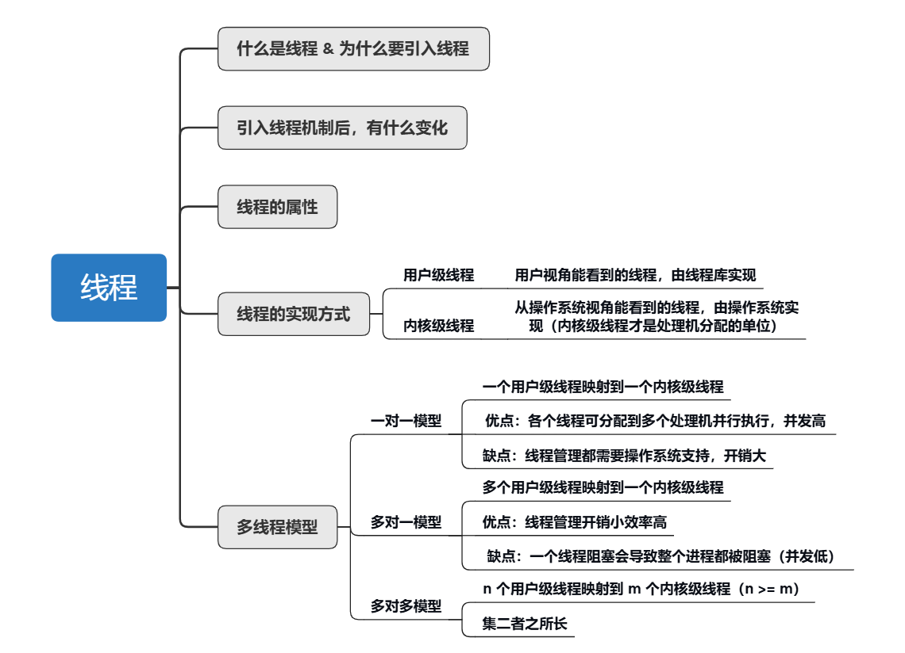

---

# 1.线程的概念

**定义：** 线程是一个基本的 CPU 执行单元，也是 **程序执行流的最小单位** 。

> 引入线程后，进程只作为 **除 CPU 之外的系统资源** 的分配单元（如打印机、内存地址空间等都是分配给进程的）；线程作为 **处理机（CPU）** 的分配单元。

**引入线程后的变化：**
1. 资源分配、调度：
   - 传统进程机制中，进程是资源分配、调度的基本单位；
   - 引入线程后，进程是资源分配的基本单位，线程是调度的基本单位。

2. 并发性：
   - 传统进程机制中，只能进程间并发；
   - 引入线程后，各线程之间也能并发，提升了并发度。

3. 系统开销：
   - 传统的进程间并发，需要切换进程的运行环境，系统开销很大；
   - 线程间并发，如果是同一个进程内的线程切换，则不需要切换进程环境，系统开销小（不涉及切换页表等）。

后续学了 **内存管理** 再来看这里时会理解得会更深刻。

