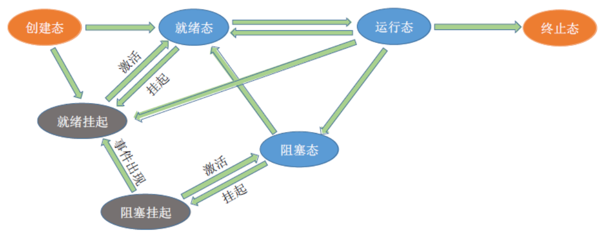

# 1.进程的调度

---

## 1.1 调度的概念

- **调度的概念：** 当有一堆任务需要处理的时候，但由于资源有限，这些事情没法同时处理，这就需要确定某种规则来决定处理这些任务的顺序，这就是“调度”研究的问题。

- **作业的概念：** 一个具体的任务。用户向系统提交一个作业 ≈ 用户让操作系统启动一个程序（来处理一个具体的任务）。

---

## 1.2 调度的三个层次

---

### 1.2.1 高级调度

**高级调度（作业调度）：** 按一定的原则 **从外存的作业后备队列中选择一个作业调入内存** ，并创建进程。每个作业只调入一次，调出一次。作业调入时会建立 PCB，调出时才撤销 PCB 。

> 简而言之：好几个程序需要启动，到底先启动哪个。

---

### 1.2.2 中级调度

当内存不够时，可能会把某些进程的数据调出到外存，等内存空闲时或者进程需要运行时再重新调入内存中。暂时调到外存等待的进程状态为 **挂起状态** ，被挂起的进程 PCB 会被组织成挂起队列。

**中级调度（内存调度）：** 按照某种策略 **决定将哪个处于挂起的进程重新调入内存** 。一个进程可能多次调出、调入内存，因此中级调度发生的频率要比高级调度高。

---

**补充知识：进程的挂起态 & 七状态模型**

暂时调到外存等待的进程状态为挂起状态（挂起态，suspend），挂起态可以分为 **就绪挂起、阻塞挂起** 两种。

**挂起 & 阻塞的区别：** 两种都是不能获得 CPU 的服务，但是挂起态是将进程从内存调出到外存中，而阻塞态的进程依然在内存中；有的操作系统会把就绪挂起和阻塞挂起分为两个队列，甚至可以根据阻塞的原因将阻塞队列细分为更多的队列。

更详细的描述可以参考： **[4.进程状态的补充](06补充.md#4进程状态的补充)** 。

---

### 1.2.3 低级调度

**低级调度（进程调度 / 处理机调度）：** 按照某种策略从就绪队列中选取一个进程，将处理机分配给它（内存 -> CPU）。进程调度是操作系统中 **最基本** 的一种调度，在一般的操作系统中都必须配置进程调度。进程调度的频率很高，一般几十毫秒一次。

---

### 1.2.4 调度层次对比表

| 特征                 | **高级调度**（High-Level） 作业调度                     | **中级调度**（Medium-Level） 内存调度 / 进程挂起                      | **低级调度**（Low-Level） 进程调度                  |
| -------------------- | ---------------------------------------------------------- | ------------------------------------------------------------------------ | ------------------------------------------------------ |
| **主要任务**         | 从外存选择作业进入内存，创建进程                           | 挂起/恢复进程，调控内存负载                                              | 从就绪队列中挑选一个进程给 CPU 执行                    |
| **发生位置**         | 外存 → 内存                                                | 内存 ↔ 外存                                                              | 内存中，就绪队列 → CPU                                 |
| **调度对象**         | **作业** （尚未成为进程）                                  | **进程** （就绪/阻塞状态）                                               | **进程** （就绪状态）                                  |
| **发生频率**         | 低（用户提交作业后）                                       | 中等（系统内存压力较大时）                                               | 高（进程调度频繁，时间片到、I/O 等）                   |
| **对进程状态的影响** | 无进程状态（尚未创建 PCB） 创建后： **创建态 → 就绪态** | 内存中的进程被挂起，变为： **就绪 → 就绪挂起** 或 **阻塞 → 阻塞挂起** | **就绪态 → 运行态** 或 **运行态 → 就绪态 / 阻塞态** |
| **由谁触发**         | 用户提交作业、系统空闲                                     | 操作系统检测内存不足、长时间等待                                         | 时间片到、I/O 完成、中断、系统调用等                   |
| **目的**             | 控制进入系统的作业数量                                     | 控制内存负载，换出暂时不活跃进程                                         | 保证 CPU 利用率，实现并发执行                          |
| **是否涉及 PCB**     | ❌（作业还不是进程）                                        | ✅（进程存在，需保存/恢复 PCB）                                           | ✅（上下文切换涉及 PCB）                                |

---

## 1.3 进程调度的时机

**需要进行进程调度与切换的情况：**

1. **主动放弃处理机：**
   - **进程正常终止**（运行完毕，调用 `exit()`）
   - **运行中异常终止**（如非法访问内存）
   - **主动请求阻塞**（如等待 I/O、信号量、资源）

2. **被动放弃处理机：**
   - **时间片用完**（抢占式调度策略）
   - **有更高优先级进程进入就绪队列**
   - **外设发起中断信号**（I/O 完成等）

---

**不能进行进程调度与切换的情况**

1. **处理中断时：**
   - 中断处理是内核与硬件交互的关键阶段，必须快速、完整执行，不能被进程切换打断。

2. **进程正在执行内核临界区代码：**
   - 为避免共享内核数据出错，进程在内核关键区域运行期间不会被切换。

3. **原语执行过程中：**
   - 原语具有原子性，不能被打断，只能一次性完成；例如对进程状态修改、PCB 链接操作。

> **补充：** 上面提到的“不允许调度切换”其实不是说完全 **不能发生上下文切换** ，而是 **调度器此时不会主动进行调度** ，为了确保系统数据结构一致性与硬件稳定性。等这些关键操作完成后，操作系统再决定是否需要调度其他进程。
---

---

## 1.4 进程调度的方式

---

## 1.5 进程的切换 & 过程

---

# 2.调度算法的评价指标

