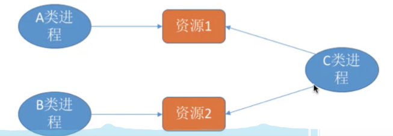
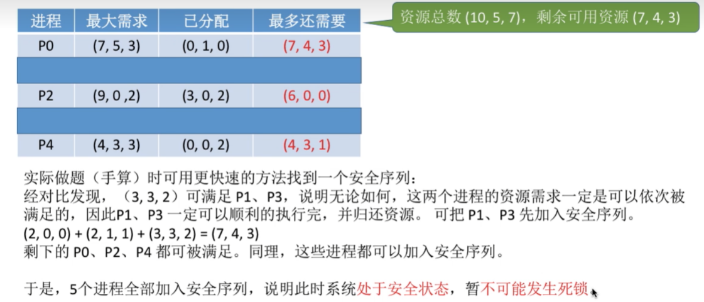
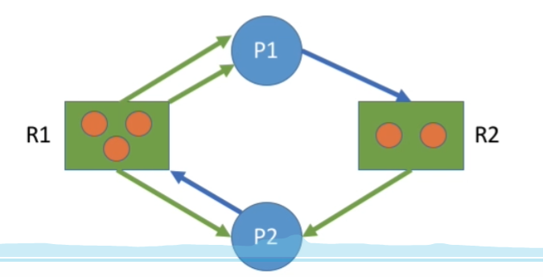

# 1.死锁的概念

---

## 1.1 基本概念

- **死锁：** 各进程 **互相等待** 对方手里的资源，导致各进程都阻塞，无法向前推进的现象。
- **饥饿：** 由于 **长期得不到想要的资源** ，某进程无法向前推进的现象。比如：在短进程优先（SPF）算法中，若有源源不断的短进程到来，则长进程将一直得不到处理机，从而发生长进程“饥饿”。
- **死循环：** 某进程执行过程中一直跳不出某个循环的现象。有时是因为程序逻辑`bug`导致的，有时是程序员故意设计的。

**共同点：** 都是进程无法顺利向前推进的现象（故意设计的死循环除外）。

|        | 区别                                                                                                                                                        |
| ------ | ----------------------------------------------------------------------------------------------------------------------------------------------------------- |
| 死锁   | 死锁一定是 **循环等待对方手里的资源** 导致的，因此如果有死锁现象，那 **至少有两个或两个以上** 的进程同时发生死锁。另外，发生死锁的进程一定处于 **阻塞态。** |
| 饥饿   | 可能只有 **一个进程** 发生饥饿。发生饥饿的进程既可能是阻塞态(如长期得不到需要的I/O设备)，也可能是就绪态(长期得不到处理机)。                                 |
| 死循环 | 可能只有一个进程发生死循环。死循环的进程可以上处理机运行（可以是运行态），只不过无法像期待的那样顺利推进。                                                  |

**总结：** 死锁和饥饿问题是由于操作系统分配资源的策略不合理导致的，而死循环是由代码逻辑的错误导致的。 **死锁和饥饿是管理者（操作系统）的问题，死循环是被管理者的问题。**

---

## 1.2 死锁产生的必要条件

- **互斥条件：** 只有对必须 **互斥使用** 的资源的争抢才会导致死锁（如哲学家的筷子、打印机设备）。像内存、扬声器这样可以 **同时让多个进程使用** 的资源是不会导致死锁的（因为进程不用阻塞等待这种资源）。
- **不剥夺条件：** 进程所获得的资源在未使用完之前，不能由其他进程强行夺走，只能主动释放。
- **请求和保持条件：** 进程 **已经保持了至少一个资源** ，但又提出了新的资源请求，而该资源又被其他进程占有，此时请求进程被阻塞，但又对自己已有的资源 **保持** 不放。
- **循环等待条件：** 存在一种进程资源的循环等待链，链中的每一个进程已获得的资源同时被下一个进程所请求。

**注意：** 发生死锁时一定有循环等待，但是发生循环等待时未必死锁（循环等待是死锁的 **必要不充分条件** ）。如果同类资源数大于`1`，则即使有循环等待，也未必发生死锁。但如果系统中每类资源都只有一个，那循环等待就是死锁的充分必要条件了。

---

## 1.3 什么时候发生死锁

比如 **系统资源的竞争**、**进程推进顺序非法**、**号量的使用不当** 等。总之，对不可剥夺资源的不合理分配，可能导致死锁。

---

## 1.4 死锁处理策略

1. **预防死锁：** 破坏死锁产生的四个必要条件中的一个或几个。
2. **避免死锁：** 用某种方法防止系统进入不安全状态，从而避免死锁（银行家算法）。
3. **死锁的检测和解除：** 允许死锁的发生，不过操作系统会负责检测出死锁的发生，然后采取某种措
施解除死锁。

---

# 2.死锁的处理策略——预防死锁

---

## 2.1 破坏互斥条件

如果把只能互斥使用的资源改造为允许共享使用，则系统不会进入死锁状态。比如：**SPOOLing**技术。

**缺点：**
- 并不是所有的资源都可以改造成可共享使用的资源。并且为了系统安全，很多地方还必须保护这种互斥性。因此，**很多时候都无法破坏互斥条件。**

---

## 2.2 破坏不可剥夺条件

1. 方案一：当某个进程请求新的资源得不到满足时，它必须立即释放保持的所有资源，待以后需要时再重新申请。也就是说，即使某些资源尚未使用完，也需要主动释放，从而破坏了不可剥夺条件。
2. 方案二：当某个进程需要的资源被其他进程所占有的时候，可以 **由操作系统协助** ，将想要的资源强行剥夺。这种方式一般需要考虑各进程的优先级（比如：剥夺调度方式，就是将处理机资源强行剥夺给优先级更高的进程使用）.

**缺点：**
- 实现起来比较 **复杂**。
- 释放已获得的资源可能造成前一阶段工作的失效。因此这种方法一般 **只适用于易保存和恢复状态的资源** ，如 CPU。
- 反复地申请和释放资源会 **增加系统开销，降低系统吞吐量。**
- 若采用方案一，意味着只要暂时得不到某个资源，之前获得的那些资源就都需要放弃，以后再重新申请。如果一直发生这样的情况，就会 **导致进程饥饿。**

---

## 2.3 破坏请求和保持条件

采用 **静态分配** 方法，即进程在运行前一次申请完它所需要的全部资源，在它的资源未满足前，不让它投入运行。一旦投入运行后，这些资源就一直归它所有，该进程就不会再请求别的任何资源了。

**缺点：**
有些资源可能只需要用很短的时间，因此如果进程的整个运行期间都一直保持着所有资源，就会 **造成严重的资源浪费，资源利用率极低** 。另外，该策略也有 **可能导致某些进程饥饿。**

如上图，如果 **资源1** 被释放了，但是 **资源2** 没被释放，那就会让 **资源1** 闲置着，因为 C 类进程需要同时拥有这两个资源才能开始运行。

---

## 2.4 破坏循环等待条件

采用 **顺序资源分配** 法，首先给系统中的资源编号，规定每个进程必须按编号递增的顺序请求资源，同类资源（即编号相同的资源）一次申请完。
原理：一个进程只有已占有小编号的资源时，才有资格申请更大编号的资源。比如`P1`有了`1 2 3`资源，那么它后面申请的资源编号只能时比`3`大的。按此规则，已持有大编号资源的进程不可能逆向地回来申请小编号的资源，从而就不会产生循环等待的现象。

**缺点：**
- **不方便增加新设备** ，因为可能需要重新分配所有的编号;
- 进程实际使用资源的顺序可能和编号递增顺序不一致，会 **导致资源浪费** ;
- 必须按规定次序申请资源，用户 **编程麻烦**。

---

# 3.死锁的处理策略

---

## 3.1 避免死锁

**银行家算法**，在资源分配之前预先判断这次分配是否会导致系统进入不安全状态，以此决定是否答应资源分配请求。反正主要目的是找一个 **安全序列** 。

安全序列：就是指如果系统按照这种序列分配资源，则每个进程都能顺利完成。只要能找出一个安全序列，系统就是 **安全状态** 。当然，安全序列可能有多个。

**如果系统处于安全状态，就一定不会发生死锁** 。如果系统进入不安全状态，就 **可能** 发生死锁（处于不安全状态未必就是发生了死锁，比如进程提前归还了一些资源；但发生死锁时一定是在不安全状态）。

---

## 3.2 检测死锁

看图的所有边能不能消除：

**死锁定理：** 如果某时刻系统的资源分配图是 **不可完全简化** 的，那么此时系统 **死锁。**

---

## 3.3 消除死锁

1. **资源剥夺法：** 挂起（暂时放到外存上）某些死锁进程，并抢占它的资源，将这些资源分配给其他的死锁进程。但是应防止被挂起的进程长时间得不到资源而饥饿。
2. **撤销进程法（或称终止进程法）：** 强制撤销部分、甚至全部死锁进程，并剥夺这些进程的资源。这种方式的优点是实现简单，但所付出的代价可能会很大。因为有些进程可能已经运行了很长时间，已经接近结束了，一旦被终止可谓功亏一篑，以后还得从头再来。
3. **进程回退法：** 让一个或多个死锁进程回退到足以避免死锁的地步。这就要求系统要记录进程的历史信息，设置还原点。

如何决定“干掉谁”：
- 进程优先级 —— 干掉优先级低的
- 已执行多长时间 —— 干掉执行时间短的
- 还要多久能完成 —— 干掉很久才会完成的
- 进程已经使用了多少资源 —— 干掉占用资源多的
- 进程是交互式的还是批处理式的 —— 干掉批处理式的（交互式的进程是用户的，干掉的话用户会不高兴/(ㄒoㄒ)/~~）