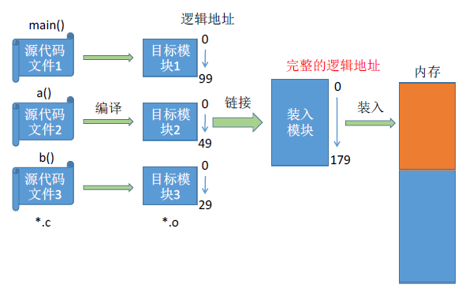
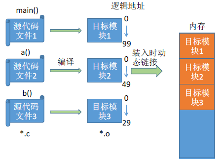
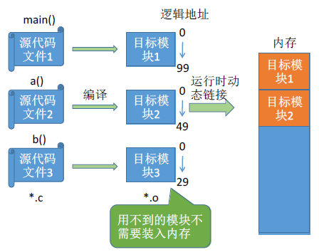
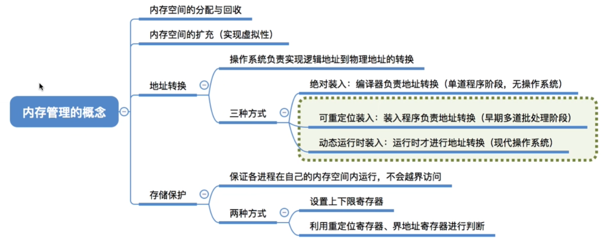
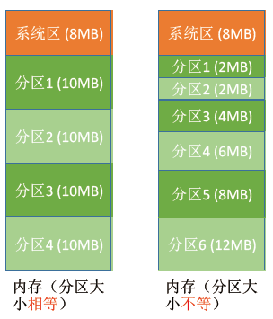
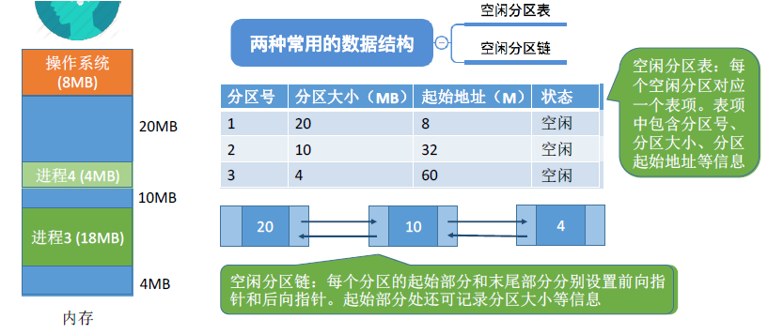

# 1.装入方式

---

## 1.1 绝对装入

在编译时，如果知道程序将放在内存的位置，编译程序就直接 **产生绝对地址的目标代码** 。适用于 **早期单道程序阶段** 的时候（无 OS）。

**缺点：** 如果分配的内存地址发生改变，需要重新编译链接生成新的目标代码，灵活性不高。

---

## 1.2 可重定位装入（静态重定位）

编译链接生成目标代码的时候，依然生成相对地址，当装入内存的时候， **把所有地址都加上起始物理地址** 。适用于 **早期多道批处理阶段** 。

**缺点：** 在装入一个作业时，必须分配其要求的全部内存空间，如果没有足够的内存，就不能够装入该作业。作业一旦装入内存，在运行期间也不可以移动，也不可以申请新的内存空间。

---

## 1.3 动态运行时装入（动态重定位）

装入内存的时候，依然采用相对地址，把地址转换工作推迟到程序真正要执行时才进行。需要借用一个 **重定位寄存器** 的支持，重定位寄存器中 **保存装入模块存放的起始位置** 。适用于 **现代操作系统** 。

**特点：**
- 可将程序分配到不连续的内存空间中
- 运行某一部分代码时，装入相应的代码即可
- 便于用户共享程序段

---

# 2.链接方式

---

## 2.1 静态链接

在程序运行之前，先将各目标模块及它们所需的库函数连接成 **一个完整的** 可执行文件（转入模块），之后不再拆开。

---

## 2.2 装入时动态链接

将各目标模块装入内存时，**边装入边链接** 的方式。依赖的动态库在 **程序启动时就已经被加载** （注意与运行时动态链接的区别）。

---

## 2.3 运行时动态链接

在执行程序中 **需要用到的目标模块才对它进行链接** 。可以方便 **修改** 和 **更新** ，便于对目标模块的 **共享** 。

---

# 2.内存管理

---

# 3.内存空间的分配与回收

---

## 3.1 单一连续分配

在单一连续分配方式中，内存被分为 **系统区** 和 **用户区** 。系统区常常位于内存的低地址部分，用于存放操作系统相关数据；用户区用于存放用户进程相关数据。

内存中 **只能有一道用户程序** ，用户程序独占整个用户区空间（早期的单道程序阶段）。

- **优点：** 实现简单；无外部碎片；可以采用覆盖技能扩充内存；不一定需要采取内存保护（因为只有一道用户程序）。
- **缺点：** 只能用于单用户、单任务的操作系统中； **有内部碎片** ，存储器利用率极低。

---

## 3.2 固定分区分配

为了可以装入多道程序，且这些程序之间又不会互相干扰，于是将整个用户空间划分为 **若干个固定大小** 的分区，在每个分区中只装入一道作业，这样就形成了最早的、最简单的一种可运行多道程序的内存管理方式。

1. 分区大小相等：缺乏灵活性，但是很适合用于用一台计算机控制多个相同对象的场合。
2. 分区大小不等：增加了灵活性，可以满足大小不同的进程需求，根据常在系统中运行的作业情况进行划分（划分多个小分区、适量中等分区、少量大分区）。

操作系统需要建立一个数据结构—— **分区说明表** ，来实现各个分区的分配与回收。每个表项对应一个分区，通常按分区的大小排列。每个表项包括： **分区的大小、起始状态、状态（是否分配）** 。

- **优点：** 实现简单、无外部碎片
- **缺点：** 
  - 当用户程序太大，可能没有一个分区满足要求，不得不采用覆盖技术，会降低性能。
  - 会 **产生内部碎片** ，内存利用率低。

---

## 3.3 动态分区分配（可变分区分配）

定义：不会预先分配分区，而是进程装入内存时， **根据进程的大小动态地建立分区** 。

---

### 3.3.1 记录内存的数据结构

**空闲分区表** 或者 **空闲分区链** 。

---

### 3.3.2 空闲分区的选择

把一个新作业装入内存时，须按照一定的动态分区分配算法，从空闲分区中选择一个分区分配给该作业。可参考后面介绍的四种算法.

---

### 3.3.3 分区的分配 & 回收

1. **分配：**

   - 情况一：当从空闲分区表中选择一个分区分配后，内存还有剩余，则修改表项。
   - 情况二：当从空闲分区表中选择一个分区分配后，刚刚好分配完，则删除该表项。

2. **回收：**

    - 情况一：回收区后面有一个相邻的空闲分区，则合并。
    - 情况二：回收区前面有一个相邻的空闲分区，则合并。
    - 情况三：回收区前后各有一个相邻的空闲分区，则三个合并为一个。
    - 情况四：回收区前后无相邻的空闲分区，则新增一个表项。

**内部碎片：** 分配给某些进程的内存区域中，有些部分没有用上。
**外部碎片：** 内存中某些空闲的分区由于太小而难以利用。

如果内存中零碎的空间太多，导致无法满足内存较大的进程，可采用 **拼凑技术** 来解决外部碎片。

**注：** 动态分区分配应该使用 **动态重定位装入** （原因：绝对装入，地址改变时需要重新编译；静态装入，不支持移动）。

---