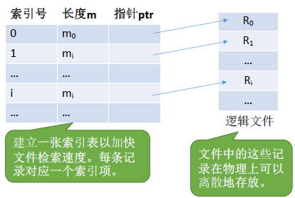
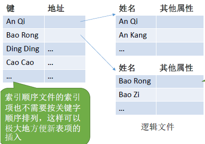
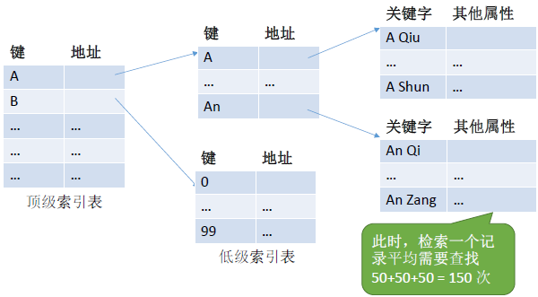

# 1.文件的基本概念和属性

---

## 1.1 文件的概念

文件：一组有意义的 **信息/数据集合** 。

---

## 1.2 文件的属性

下面是在 Linux 下执行`stat`命令查看`dotfiles`的属性的示例：
```bash
[04/06 20:29] sky@EndeavourOS:~
 >>> stat dotfiles 
  文件：dotfiles
  大小：4096            块：8          IO 块大小：4096   目录
设备：8,32      Inode: 63140       硬链接：14
权限：(0755/drwxr-xr-x)  Uid: ( 1000/     sky)   Gid: (  984/   users)
访问时间：2025-04-06 19:34:20.203588900 +0800
修改时间：2025-04-06 18:56:37.322197700 +0800
变更时间：2025-04-06 18:56:37.322197700 +0800
创建时间：2025-02-16 23:31:28.623274219 +0800
```

----

上面`stat`指令的输出示例与文件属性进行的一一对照如下：

1. **文件名：** 由创建文件的用户决定，方便识别，同一目录下不允许有重名文件。
- **`stat` 输出**：
  ```
  文件：dotfiles
  ```
  文件名就是 `dotfiles`，也就是这里查看的这个目录（目录也是一种文件！）。

2. **标识符：** 操作系统用来 **唯一识别文件的`ID`** 。
- **`stat` 输出**：
  ```
  Inode: 63140
  ```
  **inode** 编号就是文件系统内部唯一标识文件的标识符。

3. **类型：** 区分普通文件、目录、设备文件等。
- **`stat` 输出**：
  ```
  权限：(0755/drwxr-xr-x)
  ```
  这部分权限信息中的 `d` 表示该文件是一个 **目录** （directory）。

4. **位置：** 文件的存储路径。
- `stat` 输出中未直接显示完整路径，如果要看绝对路径，可以用 `realpath dotfiles`。

5. **大小：** 文件实际大小。
- **`stat` 输出**：
  ```
  大小：4096
  ```
  是目录在磁盘上占用的空间大小（单位：`Byte`）。`4096`是 **目录本身的元数据** 所占用的空间（即目录项，占了一个`block`，通常是`4KB`）。

6. **创建时间：** 文件第一次建立的时间。
- **`stat` 输出**：
  ```
  创建时间：2025-02-16 23:31:28.623274219 +0800
  ```

7. **上次修改时间：** 文件内容最后一次被修改的时间。
- **`stat` 输出**：
  ```
  修改时间：2025-04-06 18:56:37.322197700 +0800
  ```

8. **文件所有者信息：** 记录谁创建了这个文件。
- **`stat` 输出**：
  ```
  Uid: ( 1000/     sky)   Gid: (  984/   users)
  ```
  表示文件的拥有者是 `sky`，用户 ID 是 `1000`；所属用户组是 `users`，组 ID 是 `984`。

9. **保护信息：** 访问权限（谁能读/写/执行）。
- **`stat` 输出**：
  ```
  权限：(0755/drwxr-xr-x)
  ```
  `0755` 权限：
  - `owner (sky)`：读、写、执行
  - `group (users)`：读、执行
  - `others`：读、执行

---

# 2.文件的逻辑结构

**逻辑结构：** 是用户角度理解的文件内部组织方式，文件内部的数据应该如何组织起来（比如像一篇文章是按段落、行、字符组织的）。

---

## 2.1 无结构文件

文件内部的数据就是一系列 **二进制流** （比如`.jpg`图片文件）或 **字符流** （比如 `.txt`、`.c`、`.md` 文件）组成。操作系统不关心内容结构，都是交给应用程序来解析的。

---

## 2.2 有结构文件

由一组相似的记录组成，又称 **记录式文件** 。每条记录又有若干个数据项组成（如：数据库表文件），其中通常包含一个 **关键字** `key`（ps：也称索引号，但我感觉这种叫法不严谨，应试的话可以不作区分）作为唯一标识。根据每条记录是否等长，又可分为 **定长记录** 和 **可变长记录** 。

有结构文件的 **逻辑结构** 可分为三种：**顺序文件** 、 **索引文件** 、 **索引顺序文件** 。

---

### 2.2.1 顺序文件

> 文件中的记录一个接一个地 **顺序排列（逻辑上）** ，记录可以是 **定长**的或 **可变长** 的。各个记录在物理上可以顺序存储或链式存储，可与数据结构中的线性表类比。
> - **顺序存储：** 逻辑上相邻，物理上也相邻。
> > - **定长：** 可实现 **随机存取** 。记录长度为`L`，则第`i`个记录存放的相对位置是`i*L`
> > - **变长：** 无法实现随机存取。每次只能从头往后开始依次查找。
> - **链式存储：** 逻辑上相邻，物理上不相邻。
> > - 无论是定长还是可变长记录，都无法实现随机存取，每次只能从第一个记录开始依次从前往后查找。

---

顺序文件的结构：
- **串结构：** 记录一个接一个地写入文件中，不考虑关键字的大小顺序。记录的顺序只反映插入的先后，比如谁先写入谁排前。
- **顺序结构：** 记录之间的顺序按关键字顺序排列，逻辑顺序就是关键字顺序。

| 对比点   | 串结构               | 顺序结构           |
| -------- | -------------------- | ------------------ |
| 排序方式 | 按写入顺序           | 按关键字排序       |
| 查找效率 | 低，需顺序查找       | 高，可用折半查找   |
| 插入效率 | 高，直接追加         | 低，需保持顺序     |
| 应用场景 | 日志、追加型记录文件 | 电话簿、索引文件等 |

---

### 2.2.2 索引文件

索引文件主要就是解决 **可变长记录** 无法随机存取的问题。

**思路：** 为每一个文件建立一个索引表 **[索引号、长度`m`、指针`ptr`]** ，其中指针指向文件中的每个记录项的起始位置，长度为每个记录项的长度。索引表中的 **每个索引项的长度都是相等** 的，所以可以通过索引号来随机访问某一个记录项。



---

### 2.2.3 索引顺序文件

**索引文件存在的问题：** 如果文件中的记录项比较多，且每个记录项都比较小（只有`8B`），这样就会导致索引表很大，且每个索引表占`32B`，那么索引表都要比文件内容本身大`4`倍，这样对存储空间的利用率就太低了。

索引顺序文件思想：为每一组记录设置一个索引，每一组内的记录依然采用顺序文件。这就形成了“两级结构”：第一层是“组级索引”,第二层是“组内顺序文件”。



性能分析：
> - 若一个顺序文件有`10000`个记录，则根据关键字检索文件，只能从头开始顺序查找（这里指的并不是定长记录、顺序结构的顺序文件），平均须查找`5000`个记录。
> - 若采用索引顺序文件结构，可把`10000`个记录分为`100`组，每组`100`个记录。则需要先顺序查找索引表找到分组（共`100`个分组，因此索引表长度为`100`，平均需要查`50`次），找到分组后，再在分组中顺序查找记录（每个分组`100`个记录，因此平均需要查`50`次）。可见，采用索引顺序文件结构后，平均查找次数减少为`50+50=100`次。

> ps：不知道平均查找长度（`ASL`）怎么计算的，建议去重修数据结构🤣。

可以很直观的看出，索引顺序文件性能的提升

---

### 2.2.4 多级索引顺序文件

> **新问题：** 我们把数据集增大，假设有 \(10^6\) 个记录，分为`1000`组，每组`1000`个记录，那么需要查找`500 + 500 = 1000`次，依然需要查找很多次。

当我们采用多级索引时（假设是二级索引），我们把上述数据首先分为`100`组，每一组再分`100`组，其中每组`100`个记录，那么需要查找`50 + 50 + 50 = 150`次。



所以说，多级索引文件的结构本质上就是一个 **树形结构** ，更具体说，是一种多路树结构，最典型就是：数据库采用的 **B 树** / **B⁺ 树** 、 **文件系统的目录索引结构** 。

比如下面这个示例就是 Linux 的文件系统的目录索引结构：
```bash
[04/06 23:06] sky@EndeavourOS:~/workspace/cpp/数据结构 - (master)
 >>> tree -L 2
.
├── 线性表
│   ├── 链表
│   └── 链表基础
├── 栈和队列
│   ├── 进制转换
│   └── 栈和队列实现
│......
```

---

