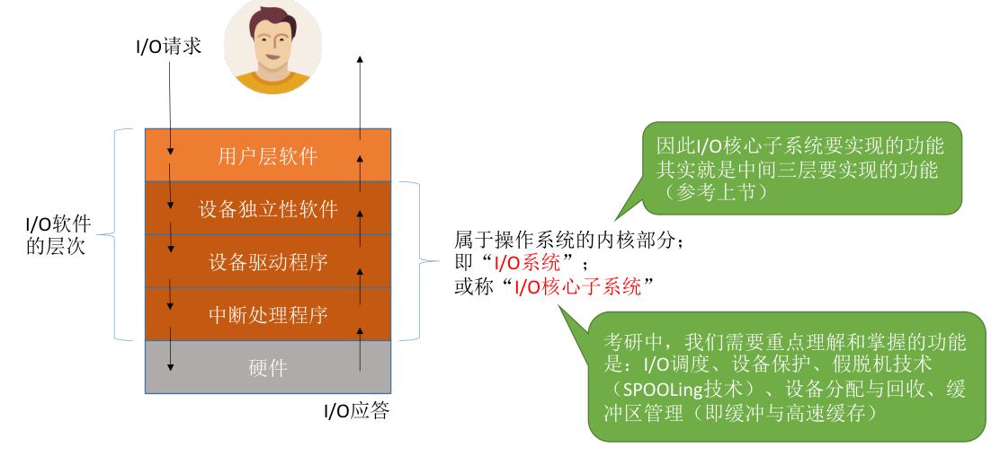
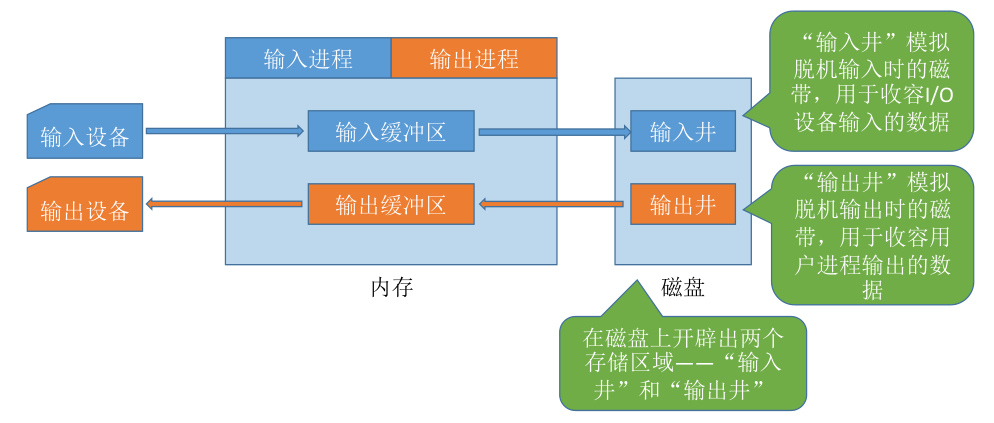
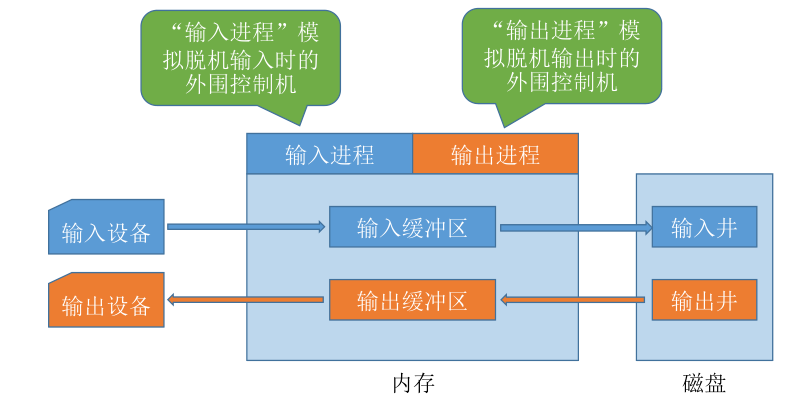

# 1.I/O 核心子系统

- 用户层软件：假脱机技术（`SPOOLing` 技术）,比如将打印请求写入磁盘中的“输出缓冲文件”中，然后后台进程读取缓冲文件去打印。
- 设备独立性软件：I/O调度、设备保护、设备分配与回收、缓冲区管理（即缓冲与高速缓存）。

> **注意：** 假脱机技术（`SPOOLing` 技术）需要请求“磁盘设备”的设备独立性软件的服务，因此一般来说假脱机技术是在用户层软件实现的。但是 408 大纲又将假脱机技术归为“I/O核心子系统”的功能，因此考试时还是以大纲为准（ **技术实现在用户层，功能归属于 I/O 核心子系统** ）。

---

**I/O 调度：** 用某种算法确定一个好的顺序来处理各个 I/O 请求。如：磁盘调度（先来先服务算法、最短寻道优先算法、SCAN 算法、C-SCAN 算法、LOOK 算法、C-LOOK 算法）。当多个磁盘 I/O 请求到来时，用某种调度算法确定满足I/O请求的顺序。

> 同理，打印机等设备也可以用先来先服务算法、优先级算法、短作业优先等算法来确定 I/O 调度顺序。

---

**设备保护：** 在 UNIX/类UNIX 系统中，设备被抽象成一种特殊的文件，每个设备也会有对应的 FCB。当用户请求访问某个设备时，系统根据 FCB 中记录的信息来判断该用户是否有相应的访问权限，以此实现“设备保护”的功能。

---

# 2.脱机技术（SPOOLing）

> **问题背景：** 手工操作阶段，主机直接从 I/O 设备获得数据，由于设备速度慢，主机速度很快。人机速度矛盾明显，主机要浪费很多时间来等待设备。

批处理阶段引入了脱机输入/输出技术（用磁带完成）：引入脱机技术后，缓解了 CPU 与慢速 I/O 设备的速度矛盾。另一方面，即使 CPU 在忙碌，也可以提前将数据输入到磁带；即使慢速的输出设备正在忙碌，也可以提前将数据输出到磁带。

**过程：** 在外围控制机的控制下，慢速输入设备的数据先被输入到更快速的磁带上。之后主机可以从快速的磁带上读入数据，从而缓解了速度矛盾。

> 为什么称为“脱机” —— 脱离主机的控制进行的输入/输出操作。

---

**输入井和输出井：**

---

**输入进程和输出进程：**

要实现 SPOOLing 技术，必须要有 **多道程序技术** 的支持。系统会建立“输入进程”和 “输出进程”。

