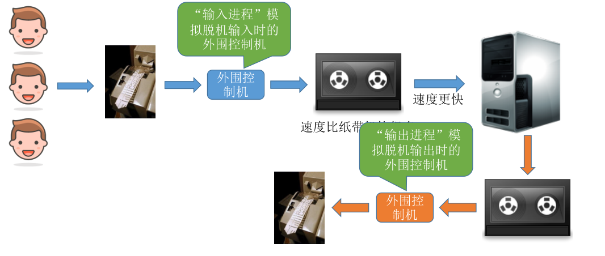
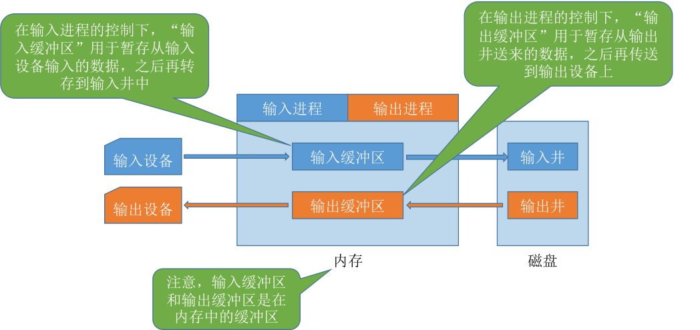
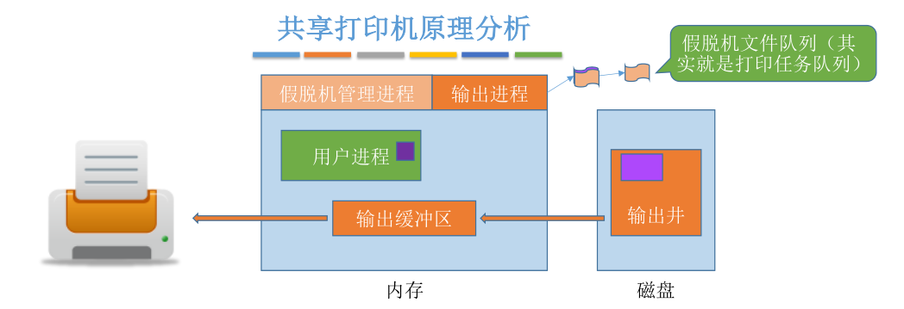
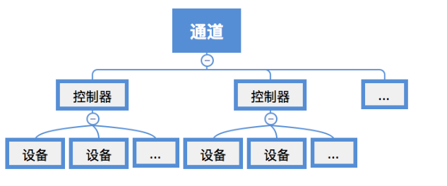
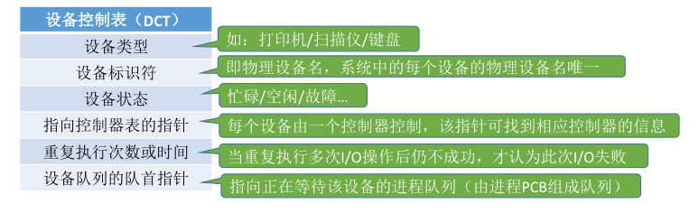
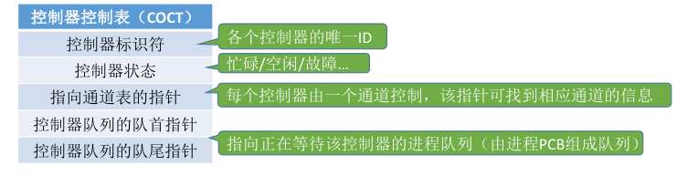
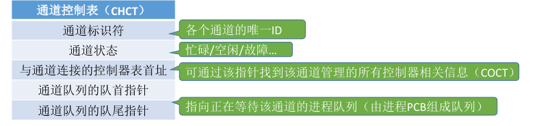

# 1.I/O 核心子系统

- 用户层软件：假脱机技术（`SPOOLing` 技术）,比如将打印请求写入磁盘中的“输出缓冲文件”中，然后后台进程读取缓冲文件去打印。
- 设备独立性软件：I/O调度、设备保护、设备分配与回收、缓冲区管理（即缓冲与高速缓存）。

> **注意：** 假脱机技术（`SPOOLing` 技术）需要请求“磁盘设备”的设备独立性软件的服务，因此一般来说假脱机技术是在用户层软件实现的。但是 408 大纲又将假脱机技术归为“I/O核心子系统”的功能，因此考试时还是以大纲为准（ **技术实现在用户层，功能归属于 I/O 核心子系统** ）。

---

**I/O 调度：** 用某种算法确定一个好的顺序来处理各个 I/O 请求。如：磁盘调度（先来先服务算法、最短寻道优先算法、SCAN 算法、C-SCAN 算法、LOOK 算法、C-LOOK 算法）。当多个磁盘 I/O 请求到来时，用某种调度算法确定满足I/O请求的顺序。

> 同理，打印机等设备也可以用先来先服务算法、优先级算法、短作业优先等算法来确定 I/O 调度顺序。

---

**设备保护：** 在 UNIX/类UNIX 系统中，设备被抽象成一种特殊的 **文件** ，每个设备也会有对应的 **FCB** 。当用户请求访问某个设备时，系统根据 FCB 中记录的信息来判断该用户是否有相应的访问权限，以此实现“设备保护”的功能。

---

# 2.假脱机技术（SPOOLing）

---

## 2.1 基本概念

> **问题背景：** 手工操作阶段，主机直接从 I/O 设备获得数据，由于设备速度慢，主机速度很快。人机速度矛盾明显，主机要浪费很多时间来等待设备。

批处理阶段引入了脱机输入/输出技术（用磁带完成）：引入脱机技术后，缓解了 CPU 与慢速 I/O 设备的速度矛盾。另一方面，即使 CPU 在忙碌，也可以提前将数据输入到磁带；即使慢速的输出设备正在忙碌，也可以提前将数据输出到磁带。

**过程：** 在 **外围控制机** 的控制下，慢速输入设备的数据先被输入到更快速的磁带上。之后主机可以从快速的磁带上读入数据，从而缓解了速度矛盾。

> 为什么称为“脱机” —— 脱离主机的控制进行的输入/输出操作。

---

## 2.2 输入井和输出井

> **注意：** **输入井和输出井** 是 SPOOLing 的核心，位于 **磁盘** 上，主要负责“用户进程数据和设备之间的桥梁”。

---

## 2.3 输入进程和输出进程

要实现 SPOOLing 技术，必须要有 **多道程序技术** 的支持。系统会建立“输入进程”和 “输出进程”。

> SPOOLing 必须靠后台进程（输入/输出进程）与用户进程并发执行，否则就只能串行工作。
> - **没有多道：** 用户进程写完数据，CPU 空转等打印。
> - **有了多道 + SPOOLing：** 用户进程写完数据，直接放到输出井里就走了，打印交给输出进程慢慢处理。

---

SPOOLing 技术是用 **软件** 的方式来模拟脱机技术。 SPOOLing 系统的组成如下：
- **输入缓冲区：** 在输入进程的控制下，“输入缓冲区”用于暂存从 **输入设备** 输入的数据，之后再转存到 **输入井** 中。
- **输出缓冲区：** 在输出进程的控制下，“输出缓冲区”用于暂存从 **输出井** 送来的数据，之后再传送到 **输出设备** 上。

> **注意：** **输入缓冲区** 和 **输出缓冲区** 是在 **内存** 中。需要注意与 **输入/输出井** 所在位置的区别。

---

## 2.4 共享打印机原理分析

- **独占式设备:** 只允许各个进程 **串行** 使用的设备。一段时间内只能满足一个进程的请求。
- **共享设备:** 允许多个进程“同时（并发）”使用的设备（宏观上同时使用，微观上可能是交替使用）。可以同时满足多个进程的使用请求。

> 比如：打印机是种“独占式设备”，若进程1正在使用打印机，则进程2请求使用打印机时必然阻塞等待。

可以用 SPOOLing 技术把打印机改造成“共享设备”。当多个用户进程提出输出打印的请求时，系统会答应它们的请求，但是并不是真正把打印机分配给他们，而是由假脱机管理进程为每个进程做两件事：
1. 在 **磁盘** 输出井中为进程申请一个空闲缓冲区，并将要打印的数据送入其中；
2. 为用户进程申请一张空白的打印请求表，并将用户的打印请求填入表中（其实就是用来说明用户的打印数据存放位置等信息的），再将该表挂到 **假脱机文件队列（打印任务队列）** 上。当打印机空闲时，输出进程会从文件队列的队头取出一张打印请求表，并根据表中的要求将要打印的数据从输出井传送到输出缓冲区，再输出到打印机进行打印。用这种方式可依次处理完全部的打印任务。

> 虽然系统中只有一个台打印机，但每个进程提出打印请求时，系统都会为在输出井中为其分配一个存储区（相当于分配了一个逻辑设备），使每个用户进程都觉得自己在独占一台打印机，从而实现对打印机的共享。

SPOOLing 技术可以把一台物理设备 **虚拟** 成逻辑上的多台设备，可将独占式设备改造成共享设备（实质/微观上仍是独占！）。

---

# 3.设备的分配与回收

---

## 3.1 设备分配时的考虑因素

**设备的固有属性：**
- **独占设备：** 一个时段只能分配给一个进程（如打印机）。
- **共享设备：** 可同时分配给多个进程使用（如磁盘），各进程往往是宏观上同时共享使用设备，而微观上交替使用。
- **虚拟设备：** 采用 SPOOLing 技术将独占设备改造成虚拟的共享设备，可同时分配给多个进程使用（如采用 SPOOLing 技术实现的共享打印机）。

**设备的分配算法：** 先来先服务、优先级高者优先、短任务优先 ……

**设备分配中的安全性：**
- **安全分配方式：** 为进程 **分配一个设备后就将进程阻塞** ，本次 I/O 完成后才将进程唤醒，即一个时段内每个进程只能使用一个设备。（比如：进程请求打印机打印输出）
  - **优点：** 破坏了“请求和保持”条件，不会死锁。
  - **缺点：** 对于一个进程来说，CPU 和 I/O 设备只能串行工作。
- **不安全分配方式：进程发出 I/O 请求后，系统为其分配 I/O 设备，进程可继续执行，之后还可以发出新的 I/O 请求。只有某个 I/O 请求得不到满足时才将进程阻塞，即一个进程可以同时使用多个设备。
  - 优点：进程的计算任务和 I/O 任务可以 **并行*8 处理，使进程迅速推进。
  - 缺点：有可能发生死锁（ps：思考下死锁的发生条件……）。

---

## 3.2 静态分配和动态分配

**静态分配：** 进程运行前为其分配全部所需资源，运行结束后归还资源（破坏了“请求和保持”条件，不会发生死锁）。

**动态分配：** 进程运行过程中动态申请设备资源。

---

## 3.3 设备分配管理中的数据结构

**“通道、控制器、设备”之间的关系：** 一个通道可控制多个设备控制器，每个设备控制器可控制多个设备。

---

**设备控制表（DCT）：** 系统为每个设备配置一张 DCT，用于记录设备情况。

> **注意：** “进程管理”章节中曾经提到过“系统会根据阻塞原因不同，将进程PCB挂到不同的阻塞队列中”。正好和 **设备队列的队首指针** 有关。

---

**控制器控制表（COCT）：** 每个设备控制器都会对应一张 COCT。操作系统根据 COCT 的信息对控制器进行操作和管理。

---

**通道控制表（CHCT）：** 每个通道都会对应一张 CHCT。操作系统根据 CHCT 的信息对通道进行操作和管理。

